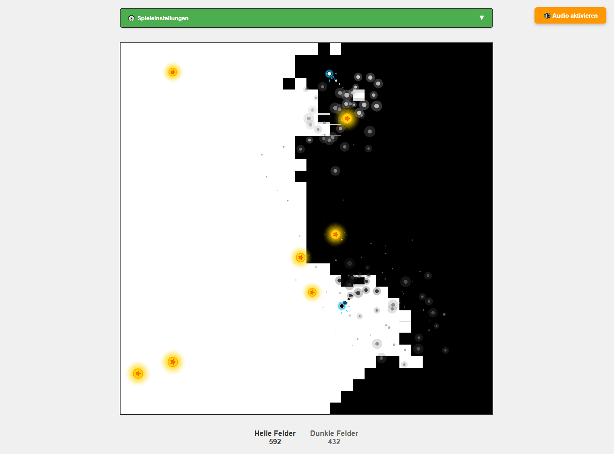

# Dual Ball Breakout Game 🎮

An advanced Breakout game with two balls, developed using **Phaser.js 3.70+** and modern web technologies. This project was created entirely automated with AI assistants.



## 🤖 AI Development

This project was **fully automated** developed with AI assistants:

- **GitHub Copilot**: Code generation, function implementation, debugging
- **Claude Sonnet 4**: Architecture design, feature planning, code optimization

### Development Process
1. **Concept development** with Claude Sonnet 4
2. **Code implementation** with GitHub Copilot
3. **Feature extensions** through iterative AI collaboration
4. **Testing & optimization** with AI-guided problem solving

## 🎯 Features

### Core Gameplay
- **Dual Ball System**: Two balls with different properties
  - **Light Ball**: Converts light fields → dark fields
  - **Dark Ball**: Converts dark fields → light fields
- **32x32 Game Field** (1024x1024 pixels)
- **Physics-based Collision** with realistic reflections

### Advanced Mechanics
- **Progressive Speed Increase**: Each powerup doubles the current speed
  - Progression: 1x → 2x → 4x → 8x → 16x → 32x → 64x → 128x → 256x (max)
  - 30-second timer per boost
- **Powerup System** with dual functionality:
  - Speed boost (progressive)
  - Explosion charges (unlimited stacking)
- **Area Explosions**: 3-field radius on charged ball collisions

### Visual Effects
- **Particle System**: 4 different particle types (Normal, Golden, Spark, Explosion)
- **3D Field Animations**: Vertical flip animations on conversion
- **Ball Trails**: 16 position gradient trail with transparency
- **Speed Indicators**: Logarithmic display for high speeds
- **Charge Display**: Golden dots or numbers for explosion charges

### Audio System
- **Web Audio API**: Procedurally generated sounds
- **3 Sound Types**:
  - Field conversion: Frequency sweeps (800→400Hz / 400→800Hz)
  - Powerup collection: Rising tones (600→1200Hz)
  - Explosions: Dual oscillator (bass + crack)

### User Interface
- **Auto-Start**: Game starts automatically without user interaction
- **Audio Button**: Orange "🔊 Activate Audio" button (top right) for browser-compliant audio activation
- **Hidden Controls**: All buttons hidden for immersive experience
- **Fullscreen Mode**: Cross-browser support with responsive design
- **Real-time Displays**: Live field counters and speed display

## 🚀 Installation & Setup

### Prerequisites
- Node.js 16+ 
- npm or yarn

### Setup
```bash
# Clone repository
git clone https://github.com/RickyKleinhempel/HtmlAI.git
cd HtmlAI

# Install dependencies
npm install

# Start development server
npm run dev
```

The game will be available at `http://localhost:3000`.

### Build for Production
```bash
# Create production build
npm run build

# Preview build
npm run serve
```

## 🏗️ Project Structure

```
├── index.html                 # Main HTML file
├── package.json              # Dependencies & scripts
├── vite.config.js            # Vite configuration
├── src/
│   ├── main.js               # Main entry point
│   ├── fullscreen.js         # Fullscreen manager
│   ├── gameObjects/
│   │   └── Ball.js           # Ball class with trail & effects
│   ├── scenes/
│   │   └── GameScene.js      # Main game scene
│   └── utils/
│       ├── AudioManager.js   # Web Audio API implementation
│       ├── ColorManager.js   # Color management & animation
│       ├── FieldManager.js   # Game field logic
│       ├── ParticleManager.js # Particle system
│       └── PowerupManager.js # Powerup system
├── AIPrompt/
│   └── complete-phaser-dual-ball-breakout-prompt.md # Complete AI prompt
└── HtmlOnly/                 # Alternative HTML-only version
```

## 🔧 Technical Details

### Tech Stack
- **Phaser.js 3.70+**: Game engine
- **Vite 5.0+**: Build tool & dev server
- **Web Audio API**: Procedural audio
- **Modern ES6+**: Modular JavaScript
- **CSS3**: Responsive design & animations

### Performance Optimizations
- **60 FPS Target**: Optimized render cycles
- **Memory Management**: Automatic particle cleanup
- **Selective Rendering**: Only visible elements
- **Graphics Batching**: Efficient Phaser.js usage

### Cross-Browser Support
- **Fullscreen APIs**: webkit, moz, ms prefixes
- **Audio Context**: Graceful fallbacks
- **Responsive Design**: Mobile & desktop

## 🎮 Game Instructions

### Objective
Convert all fields through skillful ball navigation and strategic powerup usage.

### Controls
- **Auto-Start**: Game starts automatically
- **Audio**: Orange button (top right) to activate sounds
- **Fullscreen**: F11 or fullscreen button (if visible)
- **Reset**: Browser refresh

### Strategies
1. **Powerup Collection**: Maximize speed boosts for faster field conversion
2. **Charge Management**: Collect explosion charges for area conversion
3. **Ball Coordination**: Use both balls strategically for optimal field coverage

## 🚀 Deployment

### Free Hosting Options
- **Netlify**: Drag-and-drop `dist/` folder
- **Vercel**: GitHub import with automatic builds
- **GitHub Pages**: Repository settings, deploy from `dist/` branch
- **Surge.sh**: `npm install -g surge && surge dist/`
- **Firebase Hosting**: Google CDN platform

### Build Commands
```bash
npm run build    # Production build → dist/
npm run preview  # Build preview
```

## 📋 AI Prompt for Complete Game Development

### Complete Development Prompt
The detailed AI prompt for complete recreation of this project is located at:
**`AIPrompt/complete-phaser-dual-ball-breakout-prompt.md`**

### What the Prompt Contains
This comprehensive prompt (490+ lines) provides a **complete blueprint** for AI agents:

#### 🏗️ Technical Specifications
- **Complete project structure** with all required files
- **Vite + Phaser.js setup** with configuration files
- **Detailed class architecture** for all game objects and managers
- **Performance optimizations** and best practices

#### 🎮 Gameplay Mechanics
- **Dual ball system** with type-specific behaviors
- **Progressive speed increase** (1x to 256x)
- **Advanced powerup mechanics** with explosion radius
- **Particle system** with 4 different effect types
- **3D field animations** and visual effects

#### 🔊 Audio System Integration
- **Browser-compliant audio implementation** with activation button
- **Web Audio API** with procedural sound generation
- **AudioContext management** for modern browser policies
- **Complete CSS & JavaScript** for audio button

#### 🖥️ UI/UX Features
- **Auto-start functionality** without user interaction
- **Fullscreen support** with cross-browser compatibility
- **Responsive design** for various screen sizes
- **Hidden controls** for immersive game experience

#### 📦 Deployment Ready
- **Production build system** with Vite
- **Hosting instructions** for free platforms
- **Git configuration** with .gitignore
- **Package.json** with all dependencies

### Using the Prompt
```markdown
1. Copy the entire prompt from the file
2. Paste it into an AI chat (Claude, ChatGPT, etc.)
3. The AI agent creates the complete project automatically
4. All files, configurations and features are generated
```

### Prompt Highlights
- ✅ **490+ lines** of detailed specifications
- ✅ **Complete code** for all components
- ✅ **Step-by-step implementation** with 10 development phases
- ✅ **Modern web standards** and browser compliance
- ✅ **Production-ready architecture** with modularity
- ✅ **Comprehensive testing** and validation

### AI Agent Compatibility
The prompt is optimized for:
- **Claude (Anthropic)** - Recommended for complex architecture
- **ChatGPT (OpenAI)** - Good for iterative development
- **GitHub Copilot** - Ideal for code completion
- **Other AI coding assistants** with Phaser.js knowledge

**💡 Tip**: Use the prompt in combination with a modern AI agent in a VS Code environment for optimal results.

## 🤝 AI Development

### Used AI Tools
- **GitHub Copilot**: 
  - Code completion
  - Function implementation
  - Bug fixes
  - Refactoring
- **Claude Sonnet 4**:
  - Architecture design
  - Feature planning
  - Code review
  - Documentation

### AI Development Workflow
1. **Requirements analysis** with Claude
2. **Code generation** with Copilot
3. **Iterative improvement** through AI feedback
4. **Testing & validation** with AI support

## 📄 License

MIT License - See [LICENSE](LICENSE) for details.

## 🔮 Future

This project demonstrates the potential of AI-assisted software development. All features were implemented fully automated, from concept to production-ready application.

---

**Developed with 🤖 AI Power: GitHub Copilot + Claude Sonnet 4**
